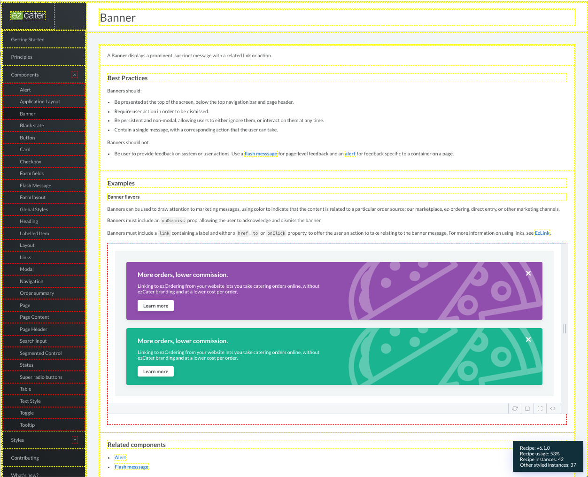

# Recipe Analytics Bookmarklet: Check your Recipe coverage

The Recipe Analytics Bookmarklet is a [Bookmarklet](https://support.mozilla.org/en-US/kb/bookmarklets-perform-common-web-page-tasks) for analyzing a web page to determine it's usage of Recipe components vs hand-rolled [styled components](https://emotion.sh/docs/styled). You can run it on any webpage that uses Recipe v6.1.1 and above.

### Installation

[Bookmarklet link](javascript:(function()%7B%22use%20strict%22%3Bvar%20link%3Bdocument.getElementById(%22bookmarklet__style_8235c31%22)%7C%7C((link%3Ddocument.createElement(%22link%22)).id%3D%22bookmarklet__style_8235c31%22%2Clink.rel%3D%22stylesheet%22%2Clink.href%3D%22data%3Atext%2Fcss%2C.recipe%3Anot(span)%20%257b%20border%3A%201px%20dashed%20yellow%3B%22%2Cdocument.body.appendChild(link))%3Bdocument.getElementById(%22bookmarklet__style_415de2c%22)%7C%7C((link%3Ddocument.createElement(%22link%22)).id%3D%22bookmarklet__style_415de2c%22%2Clink.rel%3D%22stylesheet%22%2Clink.href%3D%22data%3Atext%2Fcss%2Cspan.recipe%20%253e%20*%20%257b%20border%3A%201px%20dashed%20yellow%3B%22%2Cdocument.body.appendChild(link))%3Bdocument.getElementById(%22bookmarklet__style_59736cd%22)%7C%7C((link%3Ddocument.createElement(%22link%22)).id%3D%22bookmarklet__style_59736cd%22%2Clink.rel%3D%22stylesheet%22%2Clink.href%3D%22data%3Atext%2Fcss%2C.not-recipe%3Anot(span)%20%257b%20border%3A%201px%20dashed%20red%3B%22%2Cdocument.body.appendChild(link))%3Bdocument.getElementById(%22bookmarklet__style_38294ae%22)%7C%7C((link%3Ddocument.createElement(%22link%22)).id%3D%22bookmarklet__style_38294ae%22%2Clink.rel%3D%22stylesheet%22%2Clink.href%3D%22data%3Atext%2Fcss%2Cspan.not-recipe%20%253e%20*%20%257b%20border%3A%201px%20dashed%20red%3B%22%2Cdocument.body.appendChild(link))%3Bdocument.getElementById(%22bookmarklet__style_daa0d76%22)%7C%7C((link%3Ddocument.createElement(%22link%22)).id%3D%22bookmarklet__style_daa0d76%22%2Clink.rel%3D%22stylesheet%22%2Clink.href%3D%22https%3A%2F%2Fcdn.jsdelivr.net%2Fnpm%2Ftoastify-js%2Fsrc%2Ftoastify.min.css%22%2Cdocument.body.appendChild(link))%3B%22use%20strict%22%3Bfunction%20callback()%7Bfunction%20i(e)%7Bfor(var%20t%3Dfunction(e)%7Bvar%20t%3DObject.keys(e).find(function(e)%7Breturn%20e.startsWith(%22__reactInternalInstance%24%22)%7D)%3Breturn%20t%3Fe%5Bt%5D%3Anull%7D(e)%3Bt%26%26t.return%3B)%7Bif(%22function%22%3D%3Dtypeof(t%3Dt.return).elementType%26%26%22withComponent%22in%20t.elementType)return%20t.stateNode%3Bif(%22string%22%3D%3Dtypeof%20t.elementType)return%20null%7Dreturn%20null%7Dvar%20r%3Dvoid%200%3B!function%20e(t%2Cn)%7Bfor(n(t)%2Ct%3Dt.firstChild%3Bt%3B)e(t%2Cn)%2Ct%3Dt.nextSibling%7D(document.body%2Cfunction(e)%7Bif(3!%3D%3De.nodeType)%7Bvar%20t%3Di(e)%2Cn%3Dt%3FBoolean(t.__proto__.__recipe)%3Ae.parentElement.ownedByRecipe%3B!r%26%26t%26%26t.__proto__.__recipe%26%26(r%3D%22v%22%2Bt.__proto__.__recipe)%2Ce.ownedByRecipe%3Dn%2Ct%26%26e.classList.add(n%3F%22recipe%22%3A%22not-recipe%22)%7D%7D)%3Bvar%20e%3Ddocument.querySelectorAll(%22.recipe%22).length%2Ct%3Ddocument.querySelectorAll(%22.not-recipe%22).length%2Cn%3De%2Bt%2Co%3DMath.trunc(100%2Fn*e)%3Bwindow.Toastify(%7Btext%3A%22%3Cdiv%3E%3Cdiv%3ERecipe%3A%20%22%2B(r%7C%7C%22unknown%20version%22)%2B%22%3C%2Fdiv%3E%3Cdiv%3ERecipe%20usage%3A%20%22%2Bo%2B%22%25%3C%2Fdiv%3E%3Cdiv%3ERecipe%20instances%3A%20%22%2Be%2B%22%3C%2Fdiv%3E%3Cdiv%3EOther%20styled%20instances%3A%20%22%2Bt%2B%22%3C%2Fdiv%3E%3C%2Fdiv%3E%22%2Cduration%3A1e5%2Cgravity%3A%22bottom%22%2Cposition%3A%22right%22%2CbackgroundColor%3A%22%230f3443%22%7D).showToast()%7Dif(document.getElementById(%22bookmarklet__script_be61219%22))callback()%3Belse%7Bvar%20s%3Ddocument.createElement(%22script%22)%3Bs.addEventListener%3Fs.addEventListener(%22load%22%2Ccallback%2C!1)%3As.readyState%26%26(s.onreadystatechange%3Dcallback)%2Cs.id%3D%22bookmarklet__script_be61219%22%2Cs.src%3D%22https%3A%2F%2Fcdn.jsdelivr.net%2Fnpm%2Ftoastify-js%22%2Cdocument.body.appendChild(s)%7D%7D)())

Chrome:

> To install a bookmarklet:
>
> 1. Show the Bookmarks Toolbar by control-clicking on an empty section of the Tab Strip and checking Bookmarks Toolbar in the pop-up menu.
> 2. Drag the bookmarklet from the page to your Bookmarks Toolbar. It should appear on the toolbar.

> 1. In Chrome, click Bookmarks->Bookmark Manager. You should see a new tab with the bookmarks and folders listed.
> 2. Select the “Bookmarks Tab” folder on the left.
> 3. Click the “Organize” link, then “Add Page” in the drop down. You should see two input fields.
> 4. Type the name of the bookmark you would like (i.e., Recipe Analytics) in the first field.
> 5. Paste the javascript code from the Bookmarklet link into the URL field.

Firefox:

> To install a bookmarklet:
>
> 1. Show the Bookmarks Toolbar by control-clicking on an empty section of the Tab Strip and checking Bookmarks Toolbar in the pop-up menu.
> 2. Drag the bookmarklet link from this page to your Bookmarks Toolbar. It should appear on the toolbar.

### Usage

To view Recipe usage for your page:

1. Navigate to the page where you want to analyze
2. Click the bookmarklet on your Bookmarks Toolbar

You should see the page update, drawing yellow boxes around Recipe components, and red boxes around styled components that aren't from Recipe. A summary will also appear in the bottom right corner of the page, summarizing the usage statistics.

It should look a little bit like this:

